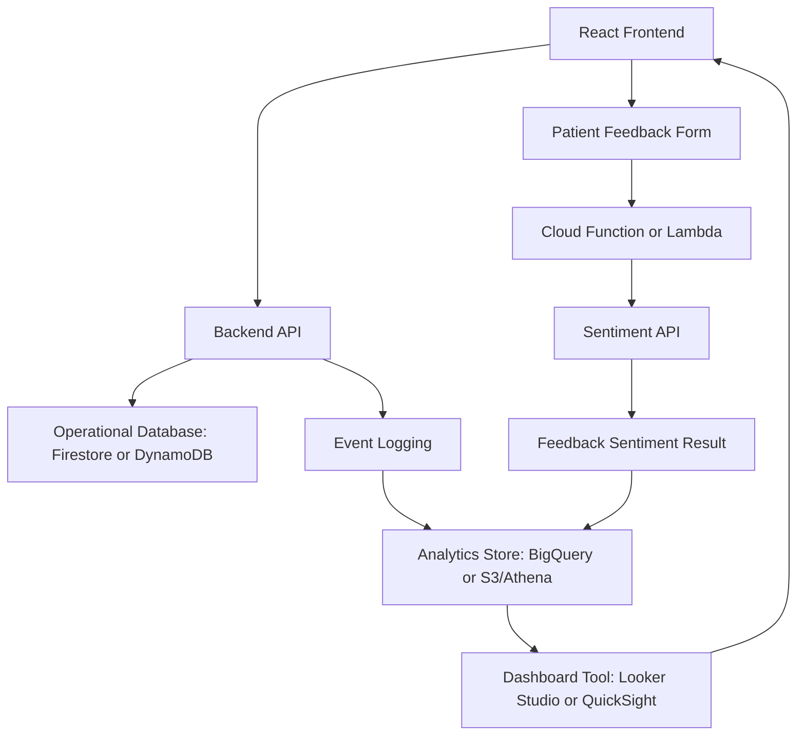
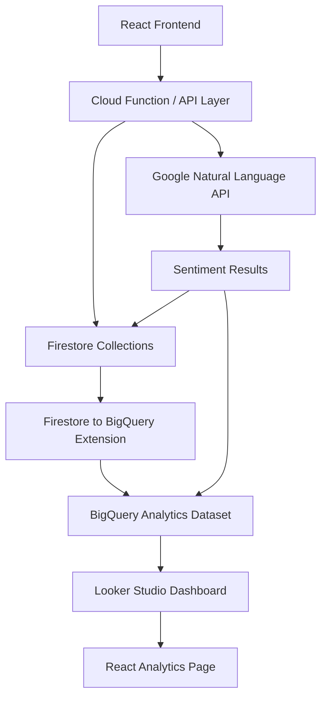
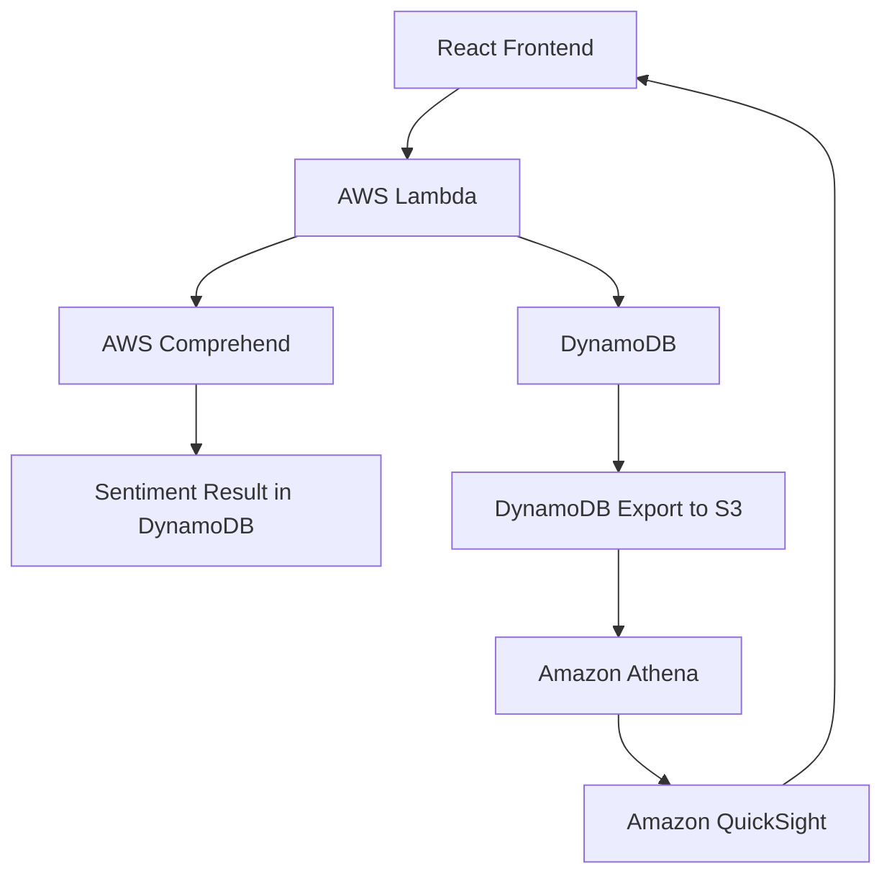

# Analytics Architecture Draft

## 1. Purpose

This document describes the proposed analytics architecture for the SAWS project. The goal is to use serverless and managed cloud services to collect events, process feedback sentiment, store analytics data, and show dashboards.

## 2. High-Level Architecture



## 3. Recommended Primary Architecture

The recommended Sprint 1 analytics architecture is:



## 4. Step-by-Step Data Flow

### Step 1: User action happens

A patient logs in, books an appointment, or submits feedback from the React frontend.

### Step 2: Backend stores operational data

The backend saves data into Firestore or DynamoDB, depending on the module.

Examples:

- User profile
- Login event
- Appointment record
- Service feedback

### Step 3: Feedback sentiment is processed

When a patient submits feedback, a serverless function sends the feedback comment to a sentiment API.

Possible services:

- Google Natural Language API
- AWS Comprehend

### Step 4: Sentiment result is stored

The backend stores the sentiment result with the feedback record.

Example:

```json
{
  "feedbackId": "fb_001",
  "sentimentLabel": "POSITIVE",
  "sentimentScore": 0.92
}
```

### Step 5: Data is prepared for dashboard

Analytics data is sent or exported into an analytics-friendly store.

Primary recommendation:

```text
Firestore → BigQuery → Looker Studio
```

AWS alternative:

```text
DynamoDB → S3 → Athena → QuickSight
```

### Step 6: Dashboard is displayed

The frontend shows dashboard output to users based on their role.

- Guests: public aggregated analytics
- Patients: public analytics and personal appointment/feedback summary
- Coordinators: full operational analytics

## 5. Why Use a Separate Analytics Store?

Operational databases are designed for application transactions. Analytics dashboards often need aggregations such as counts, trends, and group-by calculations.

Using a separate analytics store helps because:

- Dashboard queries are easier.
- Operational database performance is protected.
- Charts can be built from cleaned and summarized data.
- Future analytics can be added without changing the core app too much.

## 6. AWS Alternative Architecture

If the team chooses AWS for analytics, the architecture can be:



## 7. Why Not Build Charts Fully Manually in React?

The team could build charts directly in React using libraries like Chart.js or Recharts, but that should not be the main analytics plan for this project.

Reasons:

- The project specification specifically mentions Looker Studio and/or QuickSight.
- Dashboard tools reduce custom frontend work.
- BI tools make it easier to create tables, filters, and charts quickly.
- The analytics module becomes more cloud-focused, which matches the course objective.

React can still be used to display dashboard embeds, links, or summarized API results.

## 8. Proposed Role-Based Analytics Access

| User Type | Analytics Access |
|---|---|
| Guest | Public service popularity, overall rating, general sentiment summary |
| Registered Patient | Public analytics plus personal appointment and feedback summary |
| Coordinator | Full dashboard: patients, logins, appointments, service popularity, feedback, sentiment |

## 9. Sprint 1 Deliverables from This Architecture

For Sprint 1, this architecture can support:

- Preliminary architecture diagram
- Service justification
- Data model planning
- Dashboard wireframe planning
- API investigation notes
- GitLab issue updates and commits
