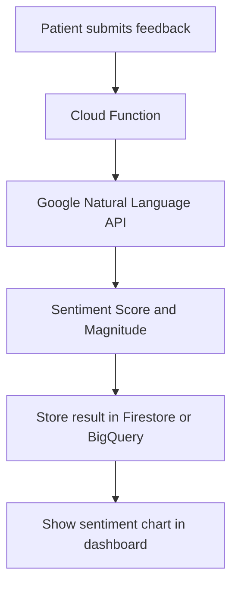
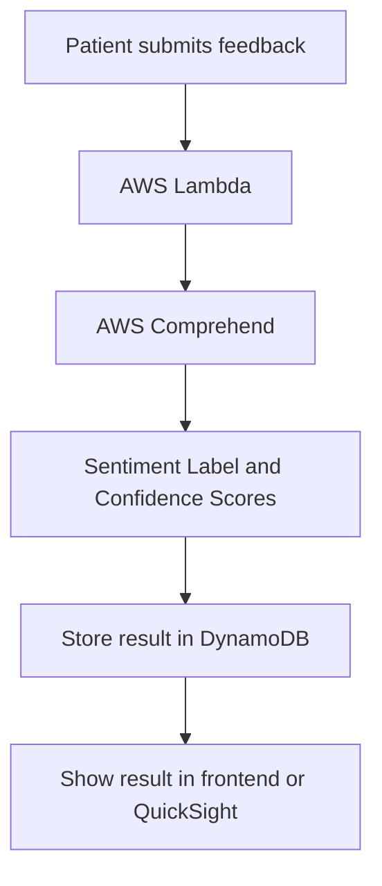

# Sentiment API Research

## 1. Purpose

The SAWS project requires patient feedback to be analyzed automatically using a cloud sentiment analysis service. The sentiment result should be displayed in the frontend.

Sentiment analysis means automatically detecting whether a text comment sounds positive, neutral, negative, or mixed.

Example:

```text
Feedback: "The appointment booking was quick and the coordinator was helpful."
Sentiment: POSITIVE
```

## 2. Why Sentiment Analysis Is Useful in SAWS

Patients may submit feedback after healthcare consultations or wellness sessions. Coordinators may not have time to read every comment immediately. Sentiment analysis helps the system quickly identify the general mood of feedback.

Usefulness:

- Quickly identify unhappy patients
- Summarize patient satisfaction
- Compare services by feedback quality
- Show overall platform sentiment to users
- Help coordinators improve service quality

## 3. Option 1: Google Natural Language API

Google Natural Language API can analyze sentiment in a document using the `documents.analyzeSentiment` method.

### Expected Flow



### Example Stored Result

```json
{
  "feedbackId": "fb_001",
  "comment": "The session was very helpful.",
  "sentimentLabel": "POSITIVE",
  "sentimentScore": 0.92,
  "sentimentMagnitude": 0.80,
  "provider": "GOOGLE_NATURAL_LANGUAGE_API"
}
```

### Why Use It?

- Good fit if the analytics pipeline uses Firestore, BigQuery, and Looker Studio.
- Easy to call from Cloud Functions.
- Numeric sentiment scores are useful for charts.
- Fits the GCP side of the multi-cloud architecture.

### Why Not Use It?

- If the feedback module is fully implemented using AWS Lambda and DynamoDB, calling a GCP API creates cross-cloud complexity.
- The team must manage Google Cloud API credentials and billing setup.

## 4. Option 2: AWS Comprehend

AWS Comprehend can analyze text and return sentiment information.

### Expected Flow



### Example Stored Result

```json
{
  "feedbackId": "fb_001",
  "comment": "The wait time was too long.",
  "sentimentLabel": "NEGATIVE",
  "positiveScore": 0.05,
  "neutralScore": 0.10,
  "negativeScore": 0.83,
  "mixedScore": 0.02,
  "provider": "AWS_COMPREHEND"
}
```

### Why Use It?

- Good fit if the backend uses AWS Lambda and DynamoDB.
- Sentiment labels are easy to understand.
- Fits well with an AWS-native analytics route such as DynamoDB, S3, Athena, and QuickSight.

### Why Not Use It?

- If the dashboard uses BigQuery and Looker Studio, sentiment results may need extra movement from AWS to GCP.
- The project may become more complex if feedback storage is already in Firestore.

## 5. Recommended Sentiment Design

The recommended design depends on where the team stores feedback.

| Feedback Storage | Recommended Sentiment API | Reason |
|---|---|---|
| Firestore | Google Natural Language API | Same cloud side as Firestore and BigQuery |
| DynamoDB | AWS Comprehend | Same cloud side as Lambda and DynamoDB |
| BigQuery analytics pipeline | Google Natural Language API | Easy to visualize in Looker Studio |
| QuickSight analytics pipeline | AWS Comprehend | AWS-native integration path |

## 6. Sprint 1 Recommendation

For Sprint 1 planning, use **Google Natural Language API** as the primary proposed sentiment service if the team chooses **Looker Studio + BigQuery** for analytics. Keep **AWS Comprehend** as an alternative if the team decides to keep the feedback pipeline on AWS.

## 7. Sentiment Label Mapping

If using Google Natural Language API, the team may need to convert numeric scores into labels.

Suggested mapping:

| Sentiment Score | Label |
|---|---|
| Greater than 0.25 | POSITIVE |
| Between -0.25 and 0.25 | NEUTRAL |
| Less than -0.25 | NEGATIVE |

This mapping can be adjusted after testing with sample feedback.

## 8. Example Test Feedback for Sprint 2

| Feedback Comment | Expected Sentiment |
|---|---|
| The doctor was very helpful and the booking was easy. | Positive |
| The appointment was okay but the waiting time was long. | Neutral or Mixed |
| The system was confusing and my appointment was delayed. | Negative |
| The wellness package was excellent and affordable. | Positive |
| I could not find my appointment details easily. | Negative |

## 9. Official Documentation Reviewed

- Google Natural Language API sentiment analysis: https://docs.cloud.google.com/natural-language/docs/analyzing-sentiment
- Google Natural Language API `documents.analyzeSentiment`: https://docs.cloud.google.com/natural-language/docs/reference/rest/v1/documents/analyzeSentiment
- AWS Comprehend sentiment analysis: https://docs.aws.amazon.com/comprehend/latest/dg/how-sentiment.html
