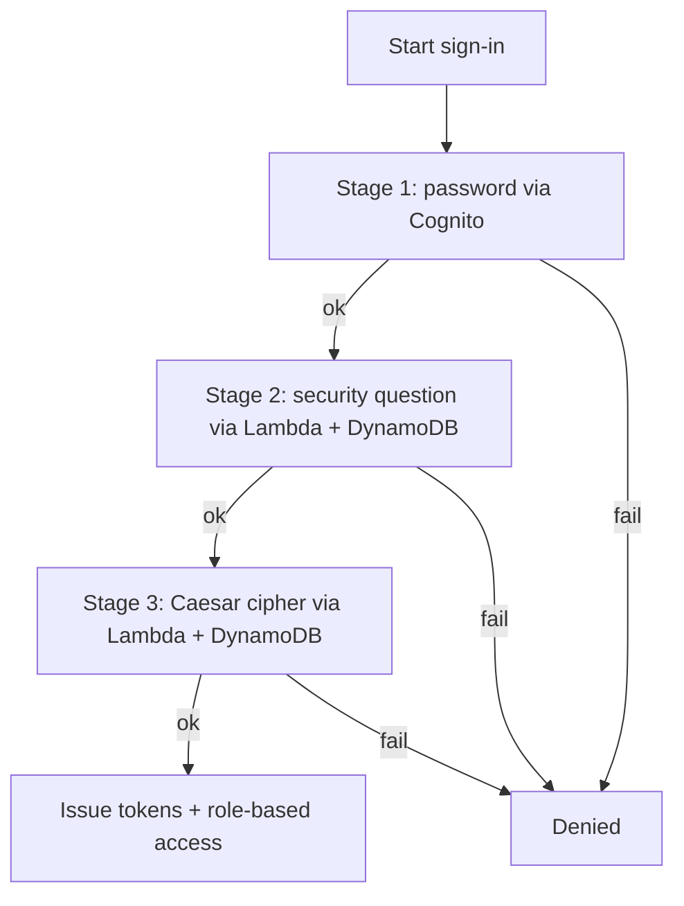

# Authentication - architecture draft (Sprint 1)

This is the proposed design for how login actually works. The goal was to use managed AWS services so we're not building password security or token handling ourselves.

## The approach

The tricky part is that the spec wants three login stages, but a normal Cognito login only checks a password. The way to add steps after the password is Cognito's custom authentication challenge flow, which is driven by three Lambda triggers. That's what lets stages 2 and 3 be real "Lambda + DynamoDB" stages like the spec says, instead of something bolted on the side.

So the plan is:

```text
React app
   -> Cognito (stage 1: user ID + password)
   -> custom challenge -> Lambda + DynamoDB (stage 2: security question)
   -> custom challenge -> Lambda + DynamoDB (stage 3: Caesar cipher)
   -> all three pass -> Cognito issues JWT tokens
   -> API Gateway checks the token + role on protected calls
```

## Registration flow

1. User fills the sign-up form; the frontend validates the inputs.
2. Cognito creates the user (ID + password).
3. We write the rest to the DynamoDB users table - role, security question, a hash of the answer, the cipher base code + shift, timestamps.
4. Hand off to notifications to send a "registered successfully" message.

## Login flow (the three stages)



Stage 1 is Cognito checking the password. Stage 2, a Lambda reads the user's security question from DynamoDB, shows it, and checks the answer against the stored hash. Stage 3, a Lambda shows the cipher clue and checks the entered code. When all three pass, Cognito hands back tokens and we send the "logged in" notification.

## Sessions and roles

Cognito gives back JWTs after login (ID, access, refresh). The frontend keeps these and sends the access token on each call. API Gateway uses a Cognito authorizer to check the token before any protected Lambda runs. For roles we'll either use Cognito groups (`patient`, `coordinator`) or a role attribute, and check it before coordinator-only actions. (Need to decide groups vs attribute - leaning groups.)

## Security notes

Don't store the password, security answer, or cipher value in plain text. Give the Lambdas least-privilege IAM (only the DynamoDB access they need). Don't reveal which stage failed. Keep token expiry short-ish.

## If we ever moved to GCP

Not the plan, since the spec names AWS here, but the mapping is close: Firebase Auth ~ Cognito, Cloud Functions ~ Lambda triggers, Firestore ~ DynamoDB. Documented as a fallback only.