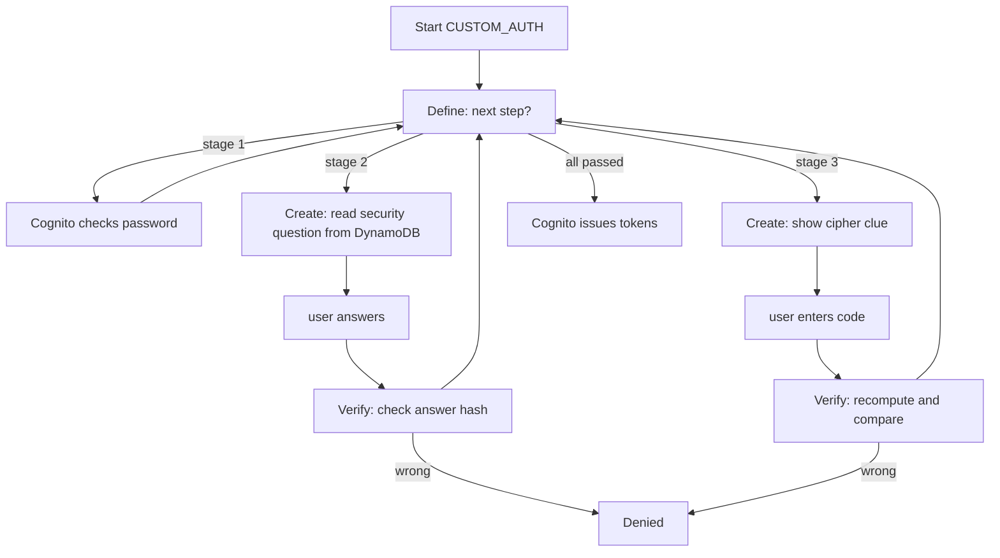

# Cognito custom auth flow - notes

The spec wants three login stages but a normal Cognito login only checks the password. The way to add the other two stages is Cognito's custom authentication challenge flow, which runs through three Lambda triggers. This is the part of the module I had to research most, so notes here.

## The three triggers

- `DefineAuthChallenge` - the controller. After each step it decides what comes next, or that the user has passed (issue tokens) or failed.
- `CreateAuthChallenge` - builds the current challenge. For us it reads the security question or the cipher clue from DynamoDB and presents it.
- `VerifyAuthChallengeResponse` - checks the user's answer against what's stored, returns correct/incorrect.

So for SAWS the controller sequences it as: password -> security question -> Caesar cipher -> done.

## How a login goes



The key thing is the answers and cipher secrets stay in the Lambda's private challenge parameters and in DynamoDB - the browser never sees them. At the end Cognito still gives normal JWT tokens, so sessions and the API Gateway authorizer work like usual.

## Rough idea of what Create returns (stage 2)

```json
{
  "publicChallengeParameters": { "question": "What is your favourite clinic?" },
  "privateChallengeParameters": { "expectedHash": "<hash>" },
  "challengeMetadata": "SECURITY_QA"
}
```

Verify then just returns `{ "answerCorrect": true }` or false.

## Things to watch in Sprint 2

- The stage ordering lives in `DefineAuthChallenge` - a bug there could skip a stage, so it needs careful testing (pass and fail cases for each stage).
- The Lambdas need a least-privilege IAM role - read access to the users table only.
- The frontend has to use the `CUSTOM_AUTH` flow and loop `respondToAuthChallenge` for each stage (Amplify or the Cognito SDK).
- This is the main risk in the module, so prototype it early.

## Docs

- Custom auth challenge triggers - https://docs.aws.amazon.com/cognito/latest/developerguide/user-pool-lambda-challenge.html
- Define / Create / Verify trigger pages under the same developer guide.