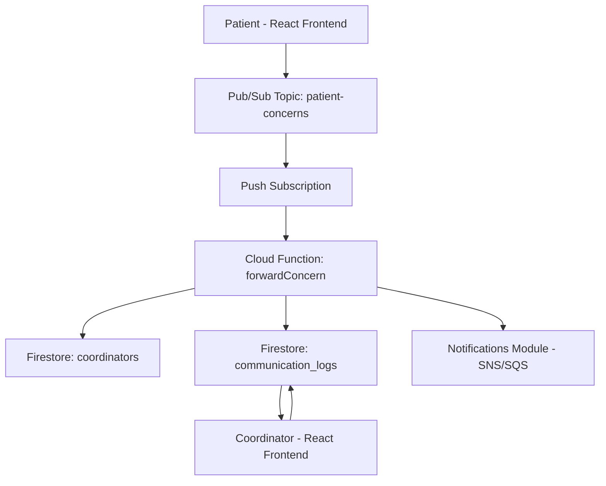
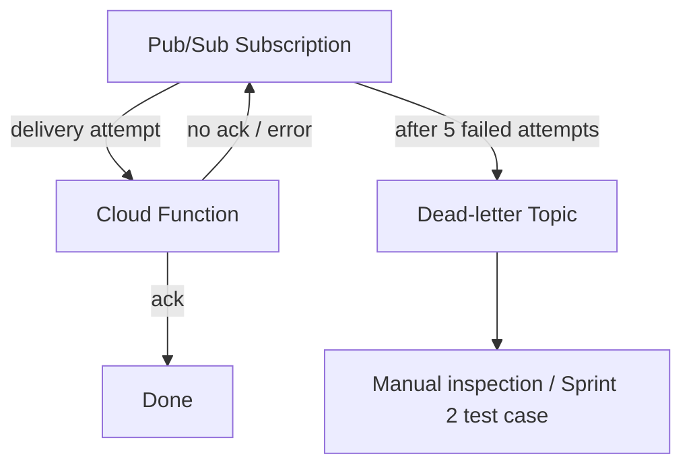
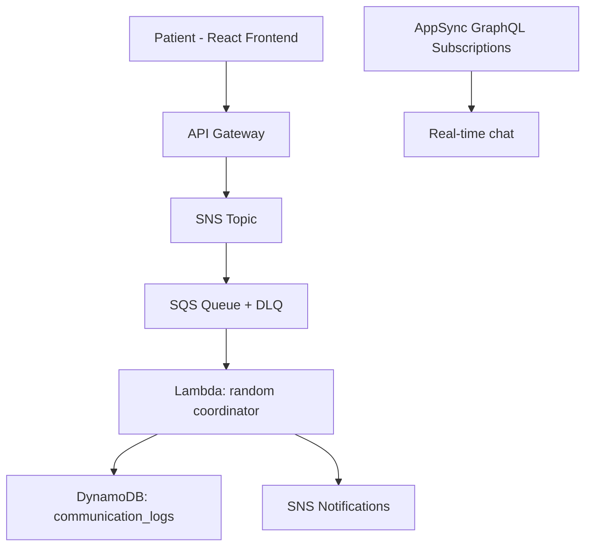

# Messaging Architecture Draft

## 1. Purpose

This document describes the proposed architecture for the SAWS message passing module. The goal is to use serverless managed services to accept patient concerns, forward them to a random coordinator, store communication logs, and support real-time chat.

## 2. High-Level Architecture



## 3. Recommended Primary Architecture

The recommended Sprint 1 messaging architecture is:

```text
Patient frontend
      ↓ publish
Pub/Sub topic (patient-concerns)
      ↓ push subscription
Cloud Function (random coordinator selection)
      ↓ write
Firestore (communication_logs)
      ↓ handoff
Notifications module (SNS/SQS)
```

Real-time chat is handled separately:

```text
Patient client  ←→  Firestore chats collection (onSnapshot)  ←→  Coordinator client
```

## 4. Step-by-Step Data Flow

### Step 1: Patient submits a concern

The patient fills the support form in the React frontend, or the virtual assistant accepts the concern. Either way, the concern is published as a message to the `patient-concerns` Pub/Sub topic.

Example message:

```json
{
  "patientId": "user_123",
  "concernText": "I cannot find my appointment reference code.",
  "submittedAt": "2026-06-10T14:30:00Z"
}
```

### Step 2: Pub/Sub delivers the message

A push subscription delivers the message to a Cloud Function over HTTPS. If the function does not acknowledge the message within the ack deadline, Pub/Sub redelivers it automatically.

### Step 3: Cloud Function selects a random coordinator

Important design note: Pub/Sub does not pick a random coordinator by itself. Within one subscription, a message goes to one subscriber endpoint. The random selection is application logic inside the function:

1. Read the `coordinators` collection from Firestore where `available == true`
2. Pick one coordinator at random
3. Continue to step 4

### Step 4: Communication log is stored

The function writes the concern into the `communication_logs` collection with the assigned coordinator and an `OPEN` status.

### Step 5: Notification handoff

The function calls the notifications module (AWS SNS/SQS) so the assigned coordinator gets alerted. This is the one cross-cloud touch point of the module.

### Step 6: Coordinator responds asynchronously

The coordinator opens their inbox view, reads the concern from `communication_logs`, writes a response, and the status changes to `ANSWERED`. The patient is notified.

### Step 7: Real-time chat (additional feature)

If a live conversation is needed, both clients open a chat. Messages are written to `chats/{chatId}/messages` in Firestore, and both clients attach `onSnapshot` listeners so new messages appear instantly without polling.

## 5. Failure Handling



- Unacknowledged messages are redelivered with exponential backoff.
- After 5 failed attempts the message moves to a dead-letter topic so it is not lost and not retried forever.
- The function should be idempotent (safe to run twice for the same message) because Pub/Sub is at-least-once delivery.

## 6. Why a Queue in the Middle?

The team could call a backend API directly and skip Pub/Sub, but that should not be the plan.

Reasons:

- The project specification names GCP Pub/Sub for message passing.
- Decoupling: the patient does not wait for a coordinator to be available.
- Reliability: retries and dead-lettering come built in.
- Scalability: spikes of concerns just queue up instead of overloading a server.
- It demonstrates event-driven serverless architecture, which matches the course objective.

## 7. AWS Alternative Architecture

If the team chooses AWS for messaging, the architecture can be:



The async half maps almost one-to-one (SNS+SQS ≈ Pub/Sub, Lambda ≈ Cloud Function, DynamoDB ≈ Firestore). The real difference is real-time chat: AWS needs AppSync or API Gateway WebSockets, which is more setup than Firestore listeners. See the service comparison document for the full decision.

## 8. Sprint 1 Deliverables from This Architecture

- Preliminary architecture diagram (draw.io file in repo)
- Service justification
- Communication log data model
- API investigation notes
- GitLab issue updates and commits
